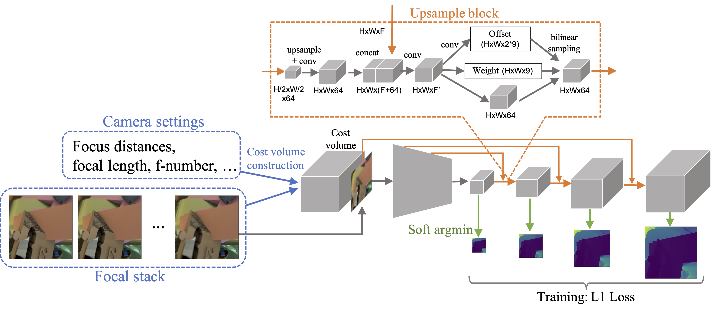

# Deep Depth from Focal Stack with Defocus Model for Camera Setting Invariance

This is the official pytorch implementation of "**Deep Depth from Focal Stack with Defocus Model for Camera-Setting Invariance**," IJCV.

### [Paper](https://link.springer.com/article/10.1007/s11263-023-01964-x?utm_source=rct_congratemailt&utm_medium=email&utm_campaign=oa_20231228&utm_content=10.1007/s11263-023-01964-x) | [arXiv](https://arxiv.org/abs/2202.13055)

## Requirements
```
CUDA 11.1
pytorch 1.8.0
tqdm
matplotlib
scikit-image
h5py
```

## Download trained models
Our trained model can be downloaded [here](https://1drv.ms/f/c/22aa8a9f0cda7e59/Ell-2gyfiqoggCIsYQAAAAABxGPfFAXTa_2Gmb05lMmeoQ?e=de3Qom).
```
tar -zxvf checkpoint.tar.gz
```

## Test on Mobile Depth
```
cd dataset/MobileDepth/data
```
Download the original data from [https://www.supasorn.com/dffdownload.html](https://www.supasorn.com/dffdownload.html):
``` 
wget https://www.supasorn.com/data/depth_from_focus_data2.zip
wget https://www.supasorn.com/data/depth_from_focus_data3.zip
unzip https://www.supasorn.com/data/depth_from_focus_data2.zip
unzip https://www.supasorn.com/data/depth_from_focus_data3.zip
```
Download depth maps:
``` 
tar -zxvf mobile_depth.tar.gz
```
Compute cost volumes:
```
cd ../python
python compute_cost_volume.py test
```
To get results, please run the following at ```DDFS/```
```
python test.py checkpoint --dataset MOBILDE_DEPTH
```

## Test on NYU Depth V2
```
cd dataset/NYUDepthV2
```
Download the original dataset:
```
wget http://horatio.cs.nyu.edu/mit/silberman/nyu_depth_v2/nyu_depth_v2_labeled.mat
```
Download focal stacks [here](https://1drv.ms/f/c/22aa8a9f0cda7e59/Ell-2gyfiqoggCIsYQAAAAABxGPfFAXTa_2Gmb05lMmeoQ?e=de3Qom) (the script to synthesize them is in [https://github.com/marcelampc/d3net_depth_estimation](https://github.com/marcelampc/d3net_depth_estimation))
```
tar -zxvf focal_stack.tar.gz
```
Compute cost volumes:
```
python compute_cost_volume.py test test_index.txt
```
To get results, please run the following at ```DDFS/```
```
python test.py checkpoint --dataset NYU_DEPTH_V2
```

## Test on real focal stack
```
cd dataset/NikonD5300
```
Our focal stacks captured with Nikon D5300 can be downloaded [here](https://1drv.ms/f/c/22aa8a9f0cda7e59/Ell-2gyfiqoggCIsYQAAAAABxGPfFAXTa_2Gmb05lMmeoQ?e=de3Qom).
```
tar -zxvf nikon_focal_stack.tar.gz
```
Compute cost volumes:
```
python compute_cost_volume.py test
```
To get results, please run the following at ```DDFS/```
```
python test.py --dataset NIKON_D5300
```

## Run baseline method
We also provided the trained model of [DefocusNet](https://github.com/dvl-tum/defocus-net) as a baseline method. At first, please download the original code as follows:
```
git clone https://github.com/dvl-tum/defocus-net.git
```
Then run the following
```
python test.py --method DEFOCUS_NET --dataset MOBILE_DEPTH | NYU_DEPTH_V2 
```